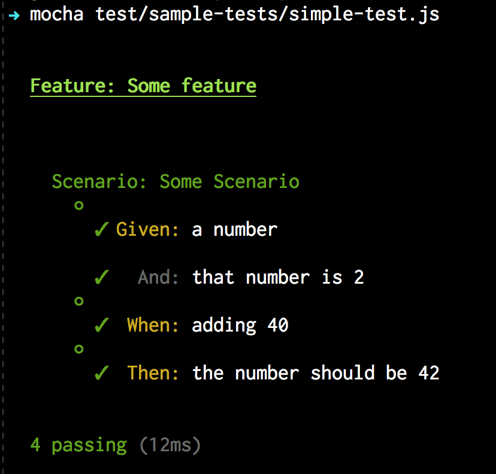

# Mocha Cakes 2

This is a version of **quangv**'s [mocha-cakes](https://github.com/quangv/mocha-cakes/) not relying on CoffeScript.

The reason for doing this is that **quangv**'s original code haven't been updated in over four years now, and it seems to be an abandoned project.

I have tried to stay as compatible as possible with older versions of NodeJS, avoiding such niceties as arrow functions, spreading etc.
## Installation

NPM:

```
npm install --save-dev mocha-cakes-2
```

## Usage

You just need to require `mocha-cakes-2` for the feature vocabulary to be accessible in the global scope:

```javascript
require('mocha-cakes-2');
require('chai').should(); // very neat `should` assertions

Feature('Some feature', () => {

  Scenario('Some Scenario', () => {

    let number = 2;

    Given('a number', () => {
      number.should.exist;
    });
    And('that number is 2', () => {
      number.should.equal(2);
    });

    When('adding 40', () => {
      number += 40;
    });

    Then('the number should be 42', () => {
      number.should.equal(42);
    });
  });
});
```

The result will look something like this:



### `<CLAUSE>.skip`

You can skip a test by using the `<CLAUSE>.skip` function, just as in mocha!

```bash
Feature('Some feature', () => {

  Scenario.skip('Skipped scenario', () => {
    // ...
  });

  Scenario('Ordinary', () => {
    // ...
  });
});
```

In the example above, only the second scenario will execute.

`skip` of course works on the other clauses as well, such as `Given`, `And`, etc.

### `<CLAUSE>.only`

You can skip a test by using the `<CLAUSE>.skip` function, just as in mocha!

```bash
Feature('Some feature', () => {

  Scenario.only('Only I will run!', () => {
    // ...
  });

  Scenario('Case 2', () => {
    // ...
  });

  Scenario('Case 3', () => {
    // ...
  });

  // ...
});
```

In the example above, only the first scenario will execute.

Just as with `skip`, `only` works on all other clauses as well.
