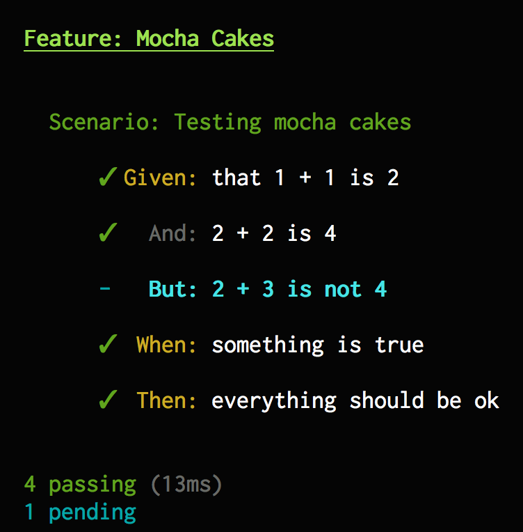
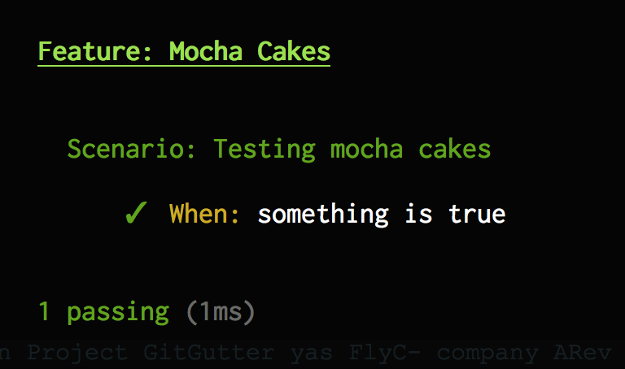

# Mocha Cakes 2

Mocha Cakes is a [Gherkin](https://github.com/cucumber/cucumber/wiki/Gherkin)/[Cucumber](https://cucumber.io/) syntax integration for the [Mocha](https://mochajs.org/) testing framework.

## Installation

NPM:

```
npm install --save-dev mocha-cakes-2
```

## Usage

You need to specify `mocha-cakes` as a mocha integration by adding the option `--ui mocha-cakes` to your `mocha` command:

``` javascript
mocha --ui mocha-cakes path/to/my/tests
```

You can also specify it in your [`mocha.opts`](https://mochajs.org/#mochaopts) file:

``` javascript
--ui mocha-cakes
```

```javascript
require('chai').should();

Feature('Some feature', () => {

  Scenario('Some Scenario', () => {

    let number = 2;

    Given('a number', () => {
      number.should.exist;
    });
    And('that number is 2', () => {
      number.should.equal(2);
    });

    When('adding 40', () => {
      number += 40;
    });

    Then('the number should be 42', () => {
      number.should.equal(42);
    });
  });
});
```

The result will look something like this:


The common Mocha functions (`describe`, `it`, `before`, `after`, etc) are also available and can be used together with Mocha Cakes.

### Upgrading from version 1.x

Replace the `require('mocha-cakes-2')` statement(s) with the `--ui mocha-cakes` option described above.
Mocha Cakes v2 does not look as flashy as v1.x since v2 leaves the styling to mocha and the specified reporter.

## API

The Mocha Cakes integration adds the following functions to the global scope:

* `Feature`
  * `Scenario`
      - `Given`
      - `When`
      - `Then`
      - `And`
      - `But`

### `.skip`

Skips a test clause. Works on all test functions.

```javascript
Feature('Some feature', () => {

  Scenario.skip('Skipped scenario', () => {
    // ...
  });

  Scenario('Ordinary', () => {
    // ...
  });
});
```



### `.only`

Only run the specified test clause. Works on all test functions.

```javascript
Feature('Some feature', () => {

  Scenario('First scenario', () => {
    // ...
  });

  Scenario('Second scenario', () => {
    // ...
  });

  Scenario.only('Only I will run!', () => {
    // ...
  });

  // ...
});
```



## Acknowledgements

Mocha Cakes 2 is heavily influenced by **quangv**'s [mocha-cakes](https://github.com/quangv/mocha-cakes/).
